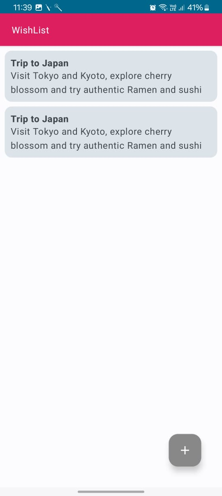
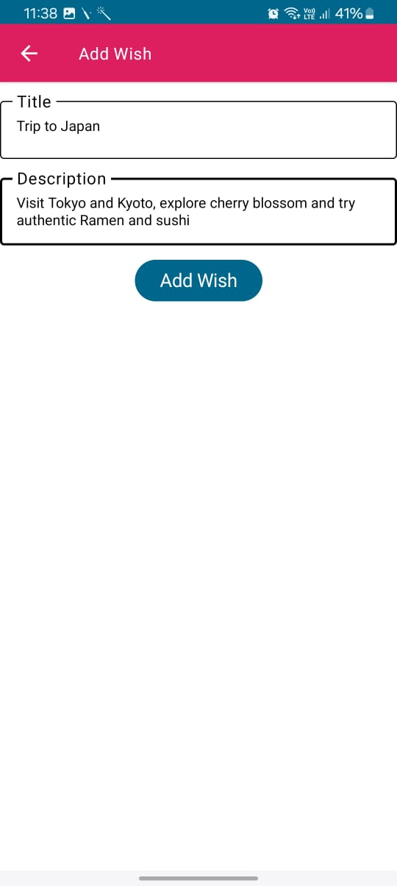

# My Wishlist App 📝

A simple Android app built using **Kotlin + Jetpack Compose** that lets you manage your personal wishlist. You can add, view, update, and delete wish items.

---

## ✨ Features

- ✅ Add new wishes with title and description
- 📋 View all your saved wishes in a scrollable list
- ✏️ Edit/update an existing wish
- ❌ Delete a wish when it's completed by swiping 

---


## 📱 Screenshots

| Feature            | Preview |
|--------------------|---------|
| **Main Interface** |  |
| **Add Wish**       |  |


## 🛠️ Tech Stack

- Kotlin
- Jetpack Compose
- MVVM Architecture
- Room Database (for local storage)
- Material Design

---

## 🚀 Getting Started

1. Clone the repository:
   ```bash
   git clone https://github.com/your-username/MyWishlistApp.git
